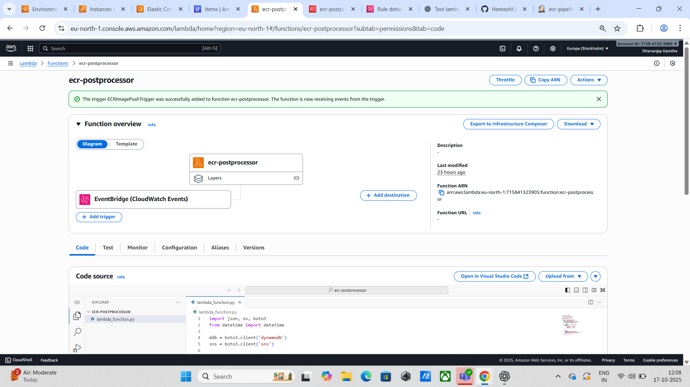

# 🚀 Continuous Delivery of Docker Images to AWS ECR Using Jenkins, Lambda & Terraform

## Project Summary
This project demonstrates how to implement an end-to-end CI/CD pipeline for Dockerized applications.  
Each source code commit automatically triggers Jenkins to build and push a Docker image to Amazon ECR, which then notifies AWS Lambda through EventBridge. Lambda logs image details in DynamoDB and sends alerts using Amazon SNS.

Deployment options:

- Manual Deployment (via AWS Console & Jenkins)
- Automated Deployment (via Terraform Infrastructure as Code)

## Workflow Overview
When you push code to GitHub:

1. Jenkins builds a Docker image  
2. The image is pushed to Amazon ECR  
3. ECR sends an event to EventBridge  
4. Lambda is triggered  
5. Lambda logs image data into DynamoDB  
6. SNS sends a notification email  

## System Architecture


## Section 1 — Manual Setup (Without Terraform)

### Workflow Summary
| Step | Task | Description |
|------|------|-------------|
| 1 | Create ECR Repository | Stores Docker images |
| 2 | Setup App Code | Node.js sample application |
| 3 | Configure Jenkins | Build & push automation |
| 4 | Setup Lambda | Handle logging and alerts |
| 5 | Configure DynamoDB + SNS | Store data and send notifications |
| 6 | Create EventBridge Rule | Triggers Lambda |
| 7 | Verify Pipeline | Validate end-to-end flow |

### 1. Create an Amazon ECR Repository
Steps:

- Go to AWS Console → ECR → Create repository  
- Repository name: sample-app-repo  
- Tag mutability: Mutable  
- Optional: Enable scan on push  

Repository URI Example:  
`123456789012.dkr.ecr.ap-south-1.amazonaws.com/sample-app-repo`

### 2. Application Source Code
Folder Structure:
```
auto-ecr-pipeline/
├── app/
│   ├── Dockerfile
│   ├── package.json
│   └── index.js
└── jenkins/
    └── Jenkinsfile
```

#### app/index.js
```js
const express = require('express');
const app = express();
const port = process.env.PORT || 3000;
app.get('/', (_, res) => res.json({ msg: 'Hello from AWS CI/CD pipeline!' }));
app.listen(port, () => console.log(`Server running on port ${port}`));
```

#### app/package.json
```json
{
  "name": "docker-ci-app",
  "version": "1.0.0",
  "main": "index.js",
  "scripts": { "start": "node index.js" },
  "dependencies": { "express": "^4.18.2" }
}
```

#### app/Dockerfile
```Dockerfile
FROM node:18-alpine
WORKDIR /usr/src/app
COPY package*.json ./
RUN npm install --only=production
COPY . .
EXPOSE 3000
CMD ["npm", "start"]
```

### 3. Jenkins Configuration
**Required Plugins**

- Docker  
- Pipeline  
- GitHub Integration  
- Amazon ECR (optional)  

**Add Credentials**  
- Type: Username with password  
- ID: aws-creds-id  
- Username: AWS_ACCESS_KEY_ID  
- Password: AWS_SECRET_ACCESS_KEY  

#### Jenkinsfile
```groovy
pipeline {
  agent any
  environment {
    AWS_REGION = 'ap-south-1'
    AWS_ACCOUNT = '123456789012'
    ECR_REPO = 'sample-app-repo'
    ECR_URL = "${AWS_ACCOUNT}.dkr.ecr.${AWS_REGION}.amazonaws.com/${ECR_REPO}"
  }

  stages {
    stage('Checkout') {
      steps {
        checkout scm
        script {
          env.IMAGE_TAG = new Date().format("yyyyMMdd-HHmmss") + "-" +
                          sh(script: "git rev-parse --short HEAD", returnStdout: true).trim()
        }
      }
    }
    stage('Build Docker Image') {
      steps {
        dir('app') {
          sh "docker build -t ${ECR_REPO}:${IMAGE_TAG} ."
        }
      }
    }
    stage('Push to ECR') {
      steps {
        withCredentials([usernamePassword(credentialsId: 'aws-creds-id', usernameVariable: 'AWS_ID', passwordVariable: 'AWS_SECRET')]) {
          sh '''
            export AWS_ACCESS_KEY_ID=$AWS_ID
            export AWS_SECRET_ACCESS_KEY=$AWS_SECRET
            aws ecr get-login-password --region ${AWS_REGION} | docker login --username AWS --password-stdin ${AWS_ACCOUNT}.dkr.ecr.${AWS_REGION}.amazonaws.com
            docker tag ${ECR_REPO}:${IMAGE_TAG} ${ECR_URL}:${IMAGE_TAG}
            docker push ${ECR_URL}:${IMAGE_TAG}
            aws events put-events --entries "[{\"Source\":\"custom.jenkins\",\"DetailType\":\"ECR Image Push\",\"Detail\":\"{\\\"repository\\\":\\\"${ECR_REPO}\\\",\\\"imageTag\\\":\\\"${IMAGE_TAG}\\\"}\"}]"
          '''
        }
      }
    }
  }
  post {
    success { echo "Image pushed to ECR: ${ECR_URL}:${IMAGE_TAG}" }
    failure { echo "Build failed." }
  }
}
```

### 4. Configure GitHub Webhook
- Go to Repo → Settings → Webhooks → Add Webhook  
- Payload URL: `http://<jenkins-server-ip>:8080/github-webhook/`  
- Content type: `application/json`  
- Event: “Just the push event”  
- Save webhook  

### 5. Create AWS Lambda Function
**Runtime:** Python 3.10  
**Function Name:** ecr-postprocessor  

#### lambda/ecr_postprocessor.py
```python
import json, os, boto3
from datetime import datetime

ddb = boto3.client('dynamodb')
sns = boto3.client('sns')

def lambda_handler(event, context):
    detail = event.get('detail', {})
    repo = detail.get('repository', 'unknown')
    tag = detail.get('imageTag', 'unknown')
    ts = datetime.utcnow().isoformat()

    ddb.put_item(
        TableName=os.environ['DDB_TABLE'],
        Item={
            'imageTag': {'S': tag},
            'repository': {'S': repo},
            'timestamp': {'S': ts}
        }
    )

    sns.publish(
        TopicArn=os.environ['SNS_ARN'],
        Message=f"New image pushed: {repo}:{tag} at {ts}",
        Subject="ECR Image Push Notification"
    )
    return {'status': 'ok'}
```

**Environment Variables**  
```
DDB_TABLE = sample-app-image-log
SNS_ARN   = arn:aws:sns:ap-south-1:123456789012:sample-app-topic
```

### 6. DynamoDB & SNS Setup
- DynamoDB Table: `sample-app-image-log` (Partition Key: imageTag)  
- SNS Topic: `sample-app-topic` with email subscription confirmation  

### 7. EventBridge Rule
Event pattern:
```json
{
  "source": ["custom.jenkins"],
  "detail-type": ["ECR Image Push"]
}
```
Target: Lambda function `ecr-postprocessor`  

### Validation Checklist
- Push code → Jenkins builds image  
- Image uploaded to ECR  
- EventBridge triggers Lambda  
- Lambda writes record to DynamoDB  
- SNS sends notification email  

## Screenshots

 🖼️ Jenkins Configuration
 <p align="center">  </p>


🖼️ Jenkins Build Success
 <p align="center">  </p>


🖼️ ECR Image Uploaded
 <p align="center">  </p>

 

🖼️ Lambda Invocation Log
 <p align="center">  </p>


🖼️ SNS Email Notification
 <p align="center">  </p>


 🖼️ DynamoDB Table Log
 <p align="center">  </p>

 🖼️ IAM Roles
 <p align="center">  </p>

 🖼️ Event Bridge
 <p align="center">  </p>

 🖼️ Lambda
 <p align="center">  </p>

 
## Section 2 — Terraform Deployment
Directory Structure:
```
terraform/
├── main.tf
├── variables.tf
├── outputs.tf
└── lambda/
    └── ecr_postprocessor.py
```

### ⚙️ main.tf
```hcl
provider "aws" {
  region = var.region
}

# 1️ ECR Repository
resource "aws_ecr_repository" "sample_repo" {
  name = var.ecr_repo_name
  image_tag_mutability = "MUTABLE"
  image_scanning_configuration {
    scan_on_push = false
  }
}

# 2️ DynamoDB Table
resource "aws_dynamodb_table" "image_log" {
  name         = var.ddb_table_name
  billing_mode = "PAY_PER_REQUEST"
  hash_key     = "imageTag"

  attribute {
    name = "imageTag"
    type = "S"
  }
}

# 3️ SNS Topic
resource "aws_sns_topic" "image_push_topic" {
  name = var.sns_topic_name
}

resource "aws_sns_topic_subscription" "email_sub" {
  topic_arn = aws_sns_topic.image_push_topic.arn
  protocol  = "email"
  endpoint  = var.notification_email
}

# 4️ Lambda Function
resource "aws_iam_role" "lambda_exec_role" {
  name = "lambda_ecr_exec_role"

  assume_role_policy = jsonencode({
    Version = "2012-10-17"
    Statement = [{
      Action = "sts:AssumeRole"
      Effect = "Allow"
      Principal = { Service = "lambda.amazonaws.com" }
    }]
  })
}

resource "aws_iam_role_policy_attachment" "lambda_basic_exec" {
  role       = aws_iam_role.lambda_exec_role.name
  policy_arn = "arn:aws:iam::aws:policy/service-role/AWSLambdaBasicExecutionRole"
}

resource "aws_iam_role_policy" "lambda_ddb_sns_policy" {
  name = "lambda-ddb-sns-policy"
  role = aws_iam_role.lambda_exec_role.id

  policy = jsonencode({
    Version = "2012-10-17"
    Statement = [
      {
        Effect = "Allow"
        Action = [
          "dynamodb:PutItem",
          "sns:Publish"
        ]
        Resource = [
          aws_dynamodb_table.image_log.arn,
          aws_sns_topic.image_push_topic.arn
        ]
      }
    ]
  })
}

data "archive_file" "lambda_zip" {
  type        = "zip"
  source_file = "${path.module}/lambda/ecr_postprocessor.py"
  output_path = "${path.module}/lambda/ecr_postprocessor.zip"
}

resource "aws_lambda_function" "ecr_postprocessor" {
  function_name = var.lambda_name
  depends_on    = [data.archive_file.lambda_zip]
  role          = aws_iam_role.lambda_exec_role.arn
  runtime       = "python3.10"
  handler       = "ecr_postprocessor.lambda_handler"
  filename      = data.archive_file.lambda_zip.output_path
  timeout       = 10

  environment {
    variables = {
      DDB_TABLE = aws_dynamodb_table.image_log.name
      SNS_ARN   = aws_sns_topic.image_push_topic.arn
    }
  }
}

# 5️ EventBridge Rule + Target
resource "aws_cloudwatch_event_rule" "jenkins_push_rule" {
  name        = "JenkinsECRPushRule"
  description = "Triggers Lambda on Jenkins ECR Image Push"
  event_pattern = jsonencode({
    "source"      : ["custom.jenkins"],
    "detail-type" : ["ECR Image Push"]
  })
}

resource "aws_cloudwatch_event_target" "lambda_target" {
  rule      = aws_cloudwatch_event_rule.jenkins_push_rule.name
  target_id = "LambdaTrigger"
  arn       = aws_lambda_function.ecr_postprocessor.arn
}

resource "aws_lambda_permission" "allow_eventbridge" {
  statement_id  = "AllowExecutionFromEventBridge"
  action        = "lambda:InvokeFunction"
  function_name = aws_lambda_function.ecr_postprocessor.function_name
  principal     = "events.amazonaws.com"
  source_arn    = aws_cloudwatch_event_rule.jenkins_push_rule.arn
}
```


### ⚙️ outputs.tf
```hcl
output "ecr_repo_url" {
  value = aws_ecr_repository.sample_repo.repository_url
}

output "lambda_function_name" {
  value = aws_lambda_function.ecr_postprocessor.function_name
}

output "sns_topic_arn" {
  value = aws_sns_topic.image_push_topic.arn
}
```


### ⚙️ variables.tf
```hcl
variable "region" { default = "ap-southeast-2" }
variable "ecr_repo_name" { default = "sample-app-repo" }
variable "ddb_table_name" { default = "sample-app-image-log" }
variable "sns_topic_name" { default = "sample-app-topic" }
variable "lambda_name" { default = "ecr-postprocessor" }
variable "notification_email" { default = "you@example.com" }
```


### ⚙️ lambda/ecr_postprocessor.py
```python
import json, os, boto3
from datetime import datetime

ddb = boto3.client('dynamodb')
sns = boto3.client('sns')

def lambda_handler(event, context):
    print("Event received:", json.dumps(event))
    detail = event.get('detail', {})
    repo = detail.get('repository', 'unknown')
    tag = detail.get('imageTag', 'unknown')
    ts = datetime.utcnow().isoformat()

    ddb.put_item(
        TableName=os.environ['DDB_TABLE'],
        Item={
            'imageTag': {'S': tag},
            'repository': {'S': repo},
            'timestamp': {'S': ts}
        }
    )

    sns.publish(
        TopicArn=os.environ['SNS_ARN'],
        Message=f"Image pushed: {repo}:{tag} at {ts}",
        Subject="ECR Image Push Notification"
    )

    return {'status': 'ok'}
```


Deploy Terraform:
```bash
cd terraform
terraform init
terraform apply -auto-approve
```

Outputs: ECR Repository URI, Lambda Function Name, SNS Topic ARN. Use these in Jenkins configuration.

Clean Up Resources:
```bash
terraform destroy -auto-approve
```
## 🚀 Next Steps After `terraform apply`

After your Terraform deployment completes successfully, all AWS resources will be automatically created — including the ECR repository, DynamoDB table, SNS topic, Lambda function, and EventBridge rule.

Now, follow the operational workflow described in *🧩 PART 1: Manual AWS Setup to complete the CI/CD pipeline configuration and verification.*

---
### ✅ Step-by-Step Continuation

---
### 1️⃣ Confirm Deployed AWS Resources

Go to your AWS Management Console and verify that Terraform has provisioned the following components mentioned in PART 1:

  - ECR repository

  - DynamoDB table

  - SNS topic and subscription

  - Lambda function

  - EventBridge rule

These components should match the names and configuration you defined in your Terraform variables (e.g., `sample-app-repo`, `sample-app-image-log`, etc.).

---

### 2️⃣ Integrate with Jenkins *(Refer to PART 1, Step 3)*

Now that the AWS infrastructure exists, return to *Step 3 of PART 1: Configure Jenkins.*

  - Open Jenkins and configure your AWS credentials.

  - Add the ECR repository URI output from Terraform to your Jenkinsfile environment variables.

  - Run the Jenkins pipeline to:

  - Build the Docker image

  - Tag it

  - Push it to ECR

  - Trigger an EventBridge event

---
### 3️⃣ Lambda Event Trigger *(Refer to PART 1, Steps 4–6)*
Once Jenkins pushes the Docker image to ECR, the EventBridge rule will automatically trigger the Lambda function created by Terraform.

  - The Lambda function will log details (repository, image tag, timestamp) to *DynamoDB*

  - It will send an email notification via *SNS*

--- 
### 4️⃣ Verify the End-to-End Flow (Refer to PART 1, Step 7)
Check that each component behaves as expected:

| Component       | Verification                          |
| --------------- | ------------------------------------- |
| **Jenkins**     | Pipeline completes successfully       |
| **ECR**         | Image appears with correct tag        |
| **EventBridge** | Trigger event logged                  |
| **Lambda**      | CloudWatch shows successful execution |
| **DynamoDB**    | New record inserted with imageTag     |
| **SNS**         | Notification email received           |

---

### 5️⃣ Clean Up (Optional)
When finished testing the pipeline, you can safely remove all resources with:

```bash
terraform destroy -auto-approve
```

---

### 🧩 Reference Summary

This Terraform setup fully automates the AWS infrastructure defined in *PART 1*, while *PART 1* itself explains the operational flow (application setup, Jenkins configuration, and event verification).
Together, both parts complete the *Automated Docker Image Deployment to Amazon ECR with Jenkins and Lambda Integration pipeline*.

---


## Benefits
- Fully Automated: End-to-end CI/CD pipeline  
- Infrastructure as Code: Reproducible setup  
- Scalable: Works across regions  
- Event-Driven: Real-time deployment  
- Modular: Easy to extend and maintain  

## Possible Enhancements
- AWS Secrets Manager for Jenkins credentials  
- CloudWatch alarms for Lambda errors  
- Blue/Green deployment strategy  
- Extend pipeline using AWS CodePipeline  

## Author
**Dhananjay Kamthe**  
Email: dhananjaykamthe2@gmail.com
