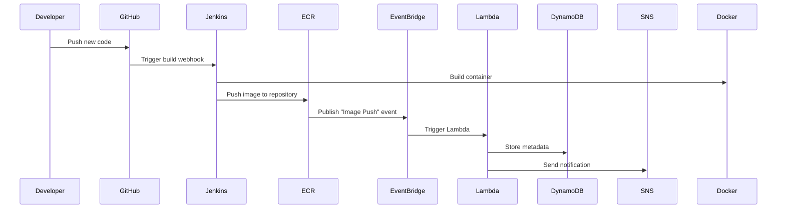

# 🚀 Continuous Delivery of Docker Images to AWS ECR Using Jenkins, Lambda & Terraform

## Project Summary
This project demonstrates how to implement an end-to-end CI/CD pipeline for Dockerized applications.  
Each source code commit automatically triggers Jenkins to build and push a Docker image to Amazon ECR, which then notifies AWS Lambda through EventBridge. Lambda logs image details in DynamoDB and sends alerts using Amazon SNS.

Deployment options:

- Manual Deployment (via AWS Console & Jenkins)
- Automated Deployment (via Terraform Infrastructure as Code)

## Workflow Overview
When you push code to GitHub:

1. Jenkins builds a Docker image  
2. The image is pushed to Amazon ECR  
3. ECR sends an event to EventBridge  
4. Lambda is triggered  
5. Lambda logs image data into DynamoDB  
6. SNS sends a notification email  

## System Architecture


## Section 1 — Manual Setup (Without Terraform)

### Workflow Summary
| Step | Task | Description |
|------|------|-------------|
| 1 | Create ECR Repository | Stores Docker images |
| 2 | Setup App Code | Node.js sample application |
| 3 | Configure Jenkins | Build & push automation |
| 4 | Setup Lambda | Handle logging and alerts |
| 5 | Configure DynamoDB + SNS | Store data and send notifications |
| 6 | Create EventBridge Rule | Triggers Lambda |
| 7 | Verify Pipeline | Validate end-to-end flow |

### 1. Create an Amazon ECR Repository
Steps:

- Go to AWS Console → ECR → Create repository  
- Repository name: sample-app-repo  
- Tag mutability: Mutable  
- Optional: Enable scan on push  

Repository URI Example:  
`123456789012.dkr.ecr.ap-south-1.amazonaws.com/sample-app-repo`

### 2. Application Source Code
Folder Structure:
```
auto-ecr-pipeline/
├── app/
│   ├── Dockerfile
│   ├── package.json
│   └── index.js
└── jenkins/
    └── Jenkinsfile
```

#### app/index.js
```js
const express = require('express');
const app = express();
const port = process.env.PORT || 3000;
app.get('/', (_, res) => res.json({ msg: 'Hello from AWS CI/CD pipeline!' }));
app.listen(port, () => console.log(`Server running on port ${port}`));
```

#### app/package.json
```json
{
  "name": "docker-ci-app",
  "version": "1.0.0",
  "main": "index.js",
  "scripts": { "start": "node index.js" },
  "dependencies": { "express": "^4.18.2" }
}
```

#### app/Dockerfile
```Dockerfile
FROM node:18-alpine
WORKDIR /usr/src/app
COPY package*.json ./
RUN npm install --only=production
COPY . .
EXPOSE 3000
CMD ["npm", "start"]
```

### 3. Jenkins Configuration
**Required Plugins**

- Docker  
- Pipeline  
- GitHub Integration  
- Amazon ECR (optional)  

**Add Credentials**  
- Type: Username with password  
- ID: aws-creds-id  
- Username: AWS_ACCESS_KEY_ID  
- Password: AWS_SECRET_ACCESS_KEY  

#### Jenkinsfile
```groovy
pipeline {
  agent any
  environment {
    AWS_REGION = 'ap-south-1'
    AWS_ACCOUNT = '123456789012'
    ECR_REPO = 'sample-app-repo'
    ECR_URL = "${AWS_ACCOUNT}.dkr.ecr.${AWS_REGION}.amazonaws.com/${ECR_REPO}"
  }

  stages {
    stage('Checkout') {
      steps {
        checkout scm
        script {
          env.IMAGE_TAG = new Date().format("yyyyMMdd-HHmmss") + "-" +
                          sh(script: "git rev-parse --short HEAD", returnStdout: true).trim()
        }
      }
    }
    stage('Build Docker Image') {
      steps {
        dir('app') {
          sh "docker build -t ${ECR_REPO}:${IMAGE_TAG} ."
        }
      }
    }
    stage('Push to ECR') {
      steps {
        withCredentials([usernamePassword(credentialsId: 'aws-creds-id', usernameVariable: 'AWS_ID', passwordVariable: 'AWS_SECRET')]) {
          sh '''
            export AWS_ACCESS_KEY_ID=$AWS_ID
            export AWS_SECRET_ACCESS_KEY=$AWS_SECRET
            aws ecr get-login-password --region ${AWS_REGION} | docker login --username AWS --password-stdin ${AWS_ACCOUNT}.dkr.ecr.${AWS_REGION}.amazonaws.com
            docker tag ${ECR_REPO}:${IMAGE_TAG} ${ECR_URL}:${IMAGE_TAG}
            docker push ${ECR_URL}:${IMAGE_TAG}
            aws events put-events --entries "[{\"Source\":\"custom.jenkins\",\"DetailType\":\"ECR Image Push\",\"Detail\":\"{\\\"repository\\\":\\\"${ECR_REPO}\\\",\\\"imageTag\\\":\\\"${IMAGE_TAG}\\\"}\"}]"
          '''
        }
      }
    }
  }
  post {
    success { echo "Image pushed to ECR: ${ECR_URL}:${IMAGE_TAG}" }
    failure { echo "Build failed." }
  }
}
```

### 4. Configure GitHub Webhook
- Go to Repo → Settings → Webhooks → Add Webhook  
- Payload URL: `http://<jenkins-server-ip>:8080/github-webhook/`  
- Content type: `application/json`  
- Event: “Just the push event”  
- Save webhook  

### 5. Create AWS Lambda Function
**Runtime:** Python 3.10  
**Function Name:** ecr-postprocessor  

#### lambda/ecr_postprocessor.py
```python
import json, os, boto3
from datetime import datetime

ddb = boto3.client('dynamodb')
sns = boto3.client('sns')

def lambda_handler(event, context):
    detail = event.get('detail', {})
    repo = detail.get('repository', 'unknown')
    tag = detail.get('imageTag', 'unknown')
    ts = datetime.utcnow().isoformat()

    ddb.put_item(
        TableName=os.environ['DDB_TABLE'],
        Item={
            'imageTag': {'S': tag},
            'repository': {'S': repo},
            'timestamp': {'S': ts}
        }
    )

    sns.publish(
        TopicArn=os.environ['SNS_ARN'],
        Message=f"New image pushed: {repo}:{tag} at {ts}",
        Subject="ECR Image Push Notification"
    )
    return {'status': 'ok'}
```

**Environment Variables**  
```
DDB_TABLE = sample-app-image-log
SNS_ARN   = arn:aws:sns:ap-south-1:123456789012:sample-app-topic
```

### 6. DynamoDB & SNS Setup
- DynamoDB Table: `sample-app-image-log` (Partition Key: imageTag)  
- SNS Topic: `sample-app-topic` with email subscription confirmation  

### 7. EventBridge Rule
Event pattern:
```json
{
  "source": ["custom.jenkins"],
  "detail-type": ["ECR Image Push"]
}
```
Target: Lambda function `ecr-postprocessor`  

### Validation Checklist
- Push code → Jenkins builds image  
- Image uploaded to ECR  
- EventBridge triggers Lambda  
- Lambda writes record to DynamoDB  
- SNS sends notification email  

## Section 2 — Terraform Deployment
Directory Structure:
```
terraform/
├── main.tf
├── variables.tf
├── outputs.tf
└── lambda/
    └── ecr_postprocessor.py
```

Deploy Terraform:
```bash
cd terraform
terraform init
terraform apply -auto-approve
```

Outputs: ECR Repository URI, Lambda Function Name, SNS Topic ARN. Use these in Jenkins configuration.

Clean Up Resources:
```bash
terraform destroy -auto-approve
```

## Benefits
- Fully Automated: End-to-end CI/CD pipeline  
- Infrastructure as Code: Reproducible setup  
- Scalable: Works across regions  
- Event-Driven: Real-time deployment  
- Modular: Easy to extend and maintain  

## Possible Enhancements
- AWS Secrets Manager for Jenkins credentials  
- CloudWatch alarms for Lambda errors  
- Blue/Green deployment strategy  
- Extend pipeline using AWS CodePipeline  

## Author
**Dhananjay Kamthe**  
Email: dhananjaykamthe2@gmail.com
